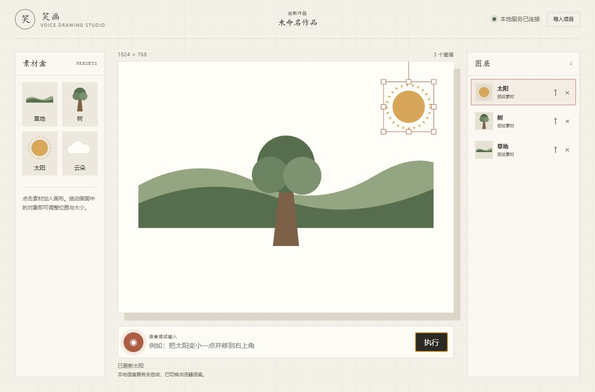

# 笑画

笑画是一款纯语音控制的 Web 端分层 AI 绘图工具。用户通过自然语言创建、选择、移动、缩放、删除和重新生成画面对象，每个对象作为独立图层存在，最终可导出图片和可继续编辑的项目数据。

## 项目状态

P1 本地可演示闭环已完成：分层画布、文本与语音命令、目标确认、素材生成与降级、项目导入以及 PNG/JSON 导出均可使用。CI 会执行格式检查、lint、类型检查、覆盖率测试、构建和 Chromium 端到端测试。

默认配置使用规则解析并连接本地 Stable Diffusion WebUI。CI 会显式使用 Mock provider；本地 ASR 和 OpenAI 兼容指令模型可通过环境变量启用。



## P1 能力

- 语音输入与实时状态反馈
- 自然语言解析为结构化绘图指令
- 单个透明背景元素生成，失败时使用预设素材降级
- 图层新增、选择、删除、移动、缩放和层级调整
- 支持“它”“刚才那个”等上下文指代
- 导出合成图片和项目 JSON

## 技术方案

- 前端：React、TypeScript、Vite
- 画布：Konva / react-konva
- 状态管理：Zustand
- 语音识别：本地 ASR 服务，浏览器 Web Speech API 仅作可选降级
- 图片生成：本地 Stable Diffusion WebUI REST API
- 服务端：Node.js 本地 API 层，统一调用 ASR、指令解析和图片生成
- 测试：Vitest、React Testing Library、Playwright
- 代码质量：ESLint、Prettier、TypeScript 严格模式

第三方依赖只负责基础框架、画布渲染、状态管理和测试。项目原创部分包括语音指令协议、上下文目标解析、分层对象模型、命令执行器、生成降级链路及作品导出流程。

## 快速运行

要求 Node.js 22+ 与 npm 10+。

```bash
npm ci
copy .env.example .env
npm run dev
```

打开 `http://127.0.0.1:5173`。Vite 使用固定端口，若该端口被占用会直接提示，避免前端静默切换端口后与 API 的 CORS 配置失配。可直接点击预设素材；在底部输入“画一个太阳”时会通过 API 调用 Stable Diffusion WebUI，再继续执行“把太阳移到右上角”“删除树”“保存作品”等命令。

完整质量门禁：

```bash
npm run format:check
npm run lint
npm run typecheck
npm run test:coverage
npm run build
npm run test:e2e
```

自动化通过后，必须执行目标设备实机测试：运行 `npm run dev`，使用真实 Chrome 或 Edge 打开 `http://127.0.0.1:5173`，完成对应功能的人工交互验收并在 PR 中记录环境、步骤和结果。

## 文档导航

- [项目准则](docs/constitution.md)
- [需求规格](docs/spec.md)
- [需求检查](docs/requirements.md)
- [技术调研](docs/research.md)
- [实施方案](docs/plan.md)
- [数据模型](docs/data-model.md)
- [API 契约](docs/contracts/api-contract.md)
- [任务拆解](docs/tasks.md)
- [P1 验收记录](docs/acceptance-report.md)
- [快速开始](docs/quickstart.md)
- [贡献指南](CONTRIBUTING.md)
- [训练营交付工作流](docs/camp-workflow.md)
- [纯语音绘图能力设计记录](docs/voice-first-design.md)
- [原始需求与规范](doc/)

## 仓库结构

```text
.
├── apps/
│   ├── api/                 # Express 本地 API 与 provider 适配器
│   └── web/                 # React + TypeScript + Konva 前端
├── packages/
│   └── contracts/           # 共享 Zod Schema 与类型
├── e2e/                     # Playwright 演示流程
├── .github/                 # CI、PR 模板
├── doc/                     # 训练营提供的原始需求与研发规范
├── docs/                    # 本项目整理的规格、方案与验收文档
│   └── contracts/           # 接口契约
├── package.json             # npm workspace 与根命令
├── CONTRIBUTING.md
├── LICENSE
└── README.md
```

## 安全与成本

- 默认运行链路不依赖境外云服务，保证中国大陆本地环境可用。
- Stable Diffusion WebUI 只监听本机或可信局域网，不直接暴露到公网。
- 图片生成限制分辨率、超时和重试次数，并优先命中预设素材或缓存。
- 所有模型输出在执行前必须通过结构校验和动作白名单。
- API 默认按客户端地址限流，跨域来源仅允许配置的 Web 地址。
- 音频仅转发给配置的本地 ASR 服务，不在应用中持久化。

## 许可证

本项目采用 [MIT License](LICENSE)。
