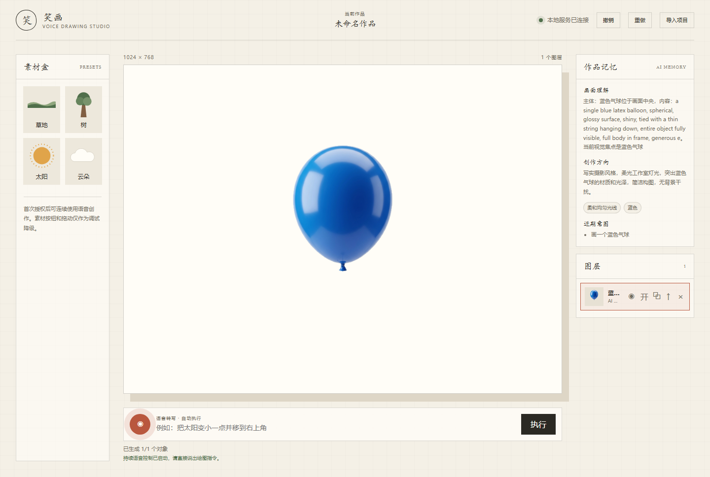
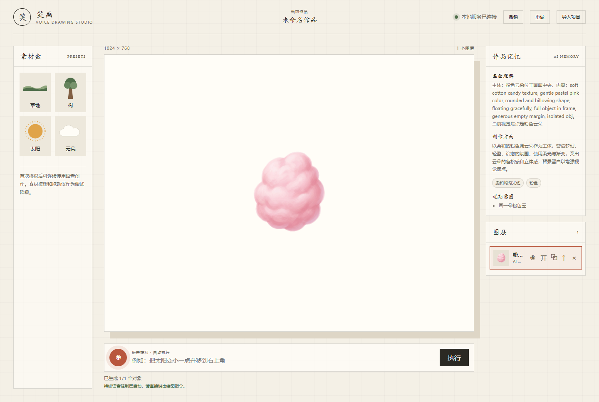
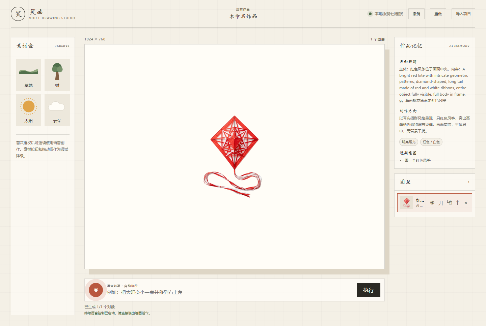
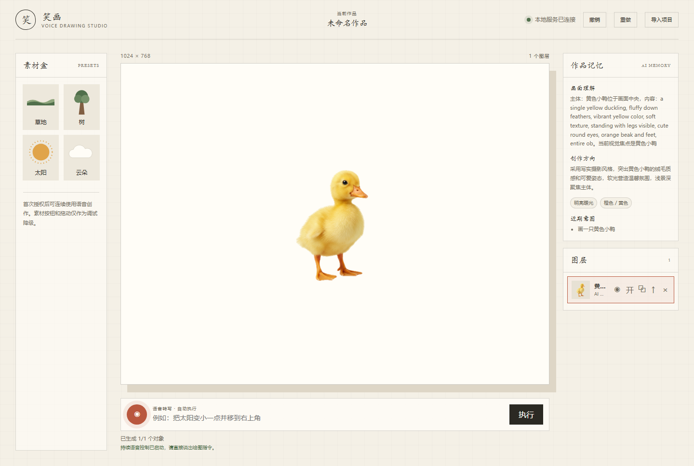
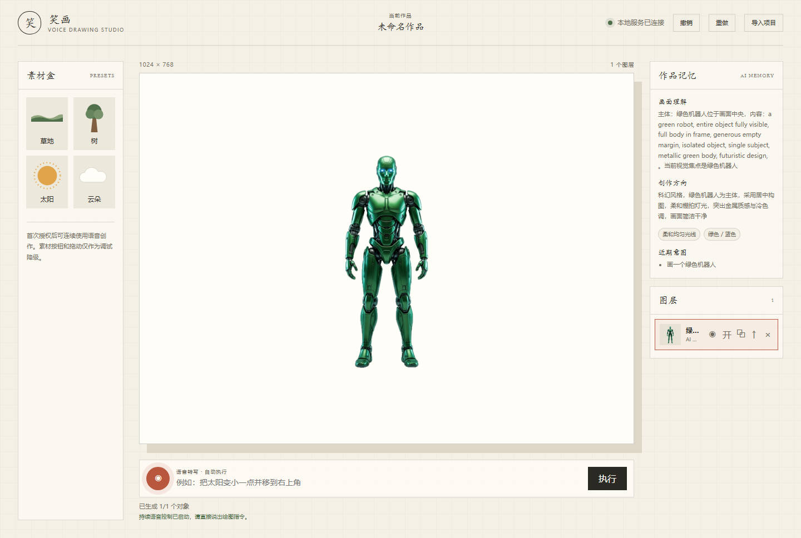

# 纯生成实例实机测试报告

测试时间：2026-06-14  
测试方式：真实浏览器自动化打开 `http://127.0.0.1:5173`，每个实例使用独立空画布，只输入自然语言生成指令，不点击素材盒预设。  
后端状态：`/api/health` 返回 `status=ok`，Fooocus ready，ASR mock。  
结果目录：`docs/assets/generated-only-cases/`

## 汇总

| 实例 | 指令 | 状态 | 是否使用预设素材 | 结果 |
| --- | --- | --- | --- | --- |
| 1 | 画一个蓝色气球 | 通过 | 否 | `case-01-blue-balloon-result.png` |
| 2 | 画一朵粉色云 | 通过 | 否 | `case-02-pink-cloud-result.png` |
| 3 | 画一个红色风筝 | 通过 | 否 | `case-03-red-kite-result.png` |
| 4 | 画一只黄色小鸭 | 通过 | 否 | `case-04-yellow-duck-result.png` |
| 5 | 画一个绿色机器人 | 通过 | 否 | `case-05-green-robot-result.png` |

说明：第 1 个实例首轮遇到“提示词增强服务超时或不可用”，已保存为 `case-01-blue-balloon-first-attempt.json`；随后重新执行同一指令并成功生成。

## 实例 1：蓝色气球

指令：

```text
画一个蓝色气球
```



## 实例 2：粉色云

指令：

```text
画一朵粉色云
```



## 实例 3：红色风筝

指令：

```text
画一个红色风筝
```



## 实例 4：黄色小鸭

指令：

```text
画一只黄色小鸭
```



## 实例 5：绿色机器人

指令：

```text
画一个绿色机器人
```



## 保存文件

每个实例分别保存：

- `*-started.png`：提交指令后的开始/占位状态截图
- `*-result.png`：最终结果截图
- `*.json`：指令、反馈、图层面板、作品记忆、控制台错误和是否使用预设素材

完整汇总见：`docs/assets/generated-only-cases/summary.json`

