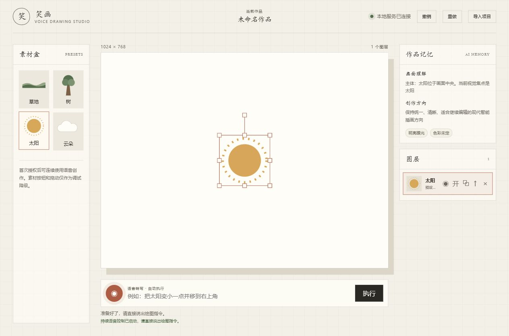
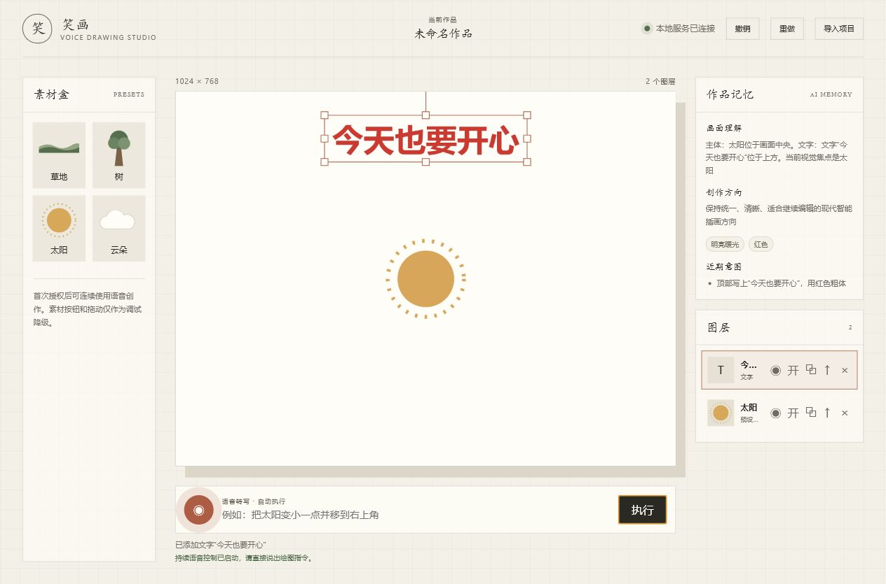
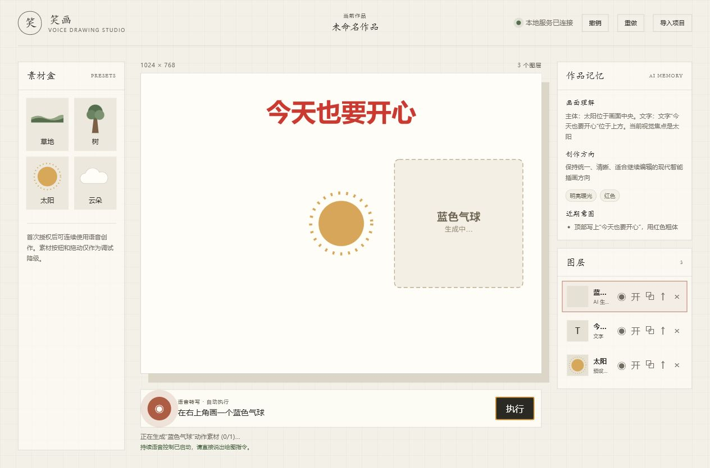
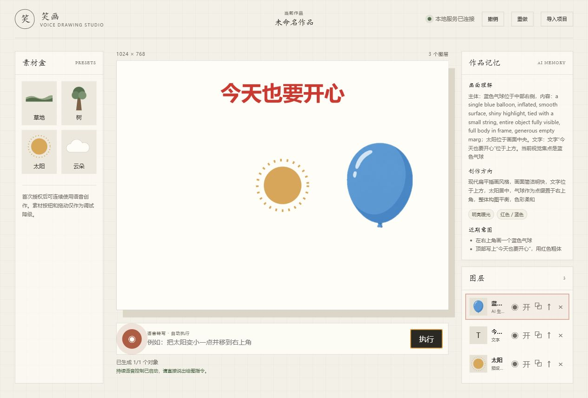
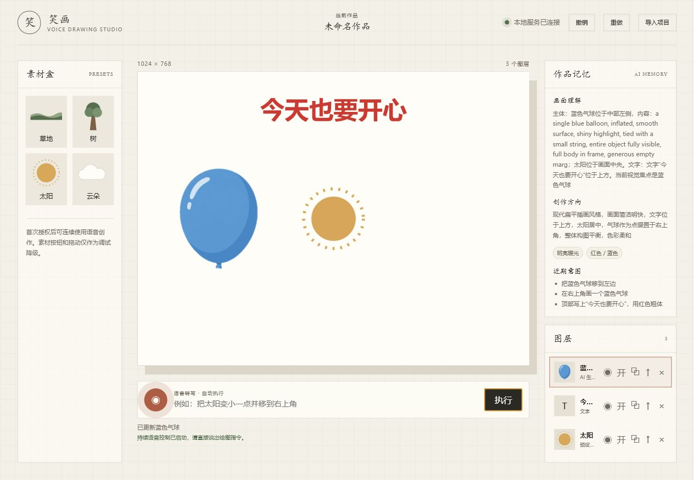
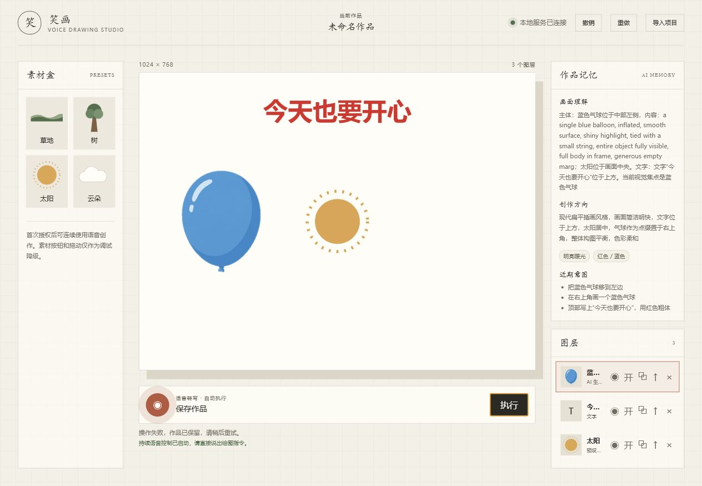

# 笑画使用说明

本文面向本地演示和验收，说明如何从启动应用到完成一幅可编辑的分层作品。

## 运行准备

要求：

- Node.js 22+、npm 10+
- Python 3.11+
- 本地 Fooocus 源码、CUDA Python 环境和 SDXL checkpoint
- Chrome 或 Edge

启动：

```bash
npm ci
copy .env.example .env
npm run dev
```

打开 `http://127.0.0.1:5173`。后端健康检查可访问 `http://127.0.0.1:8000/api/health`。

## 工作台总览

页面分为三块：

- 左侧“素材盒”：提供草地、树、太阳、云朵等调试/降级素材。
- 中间“绘图工作区”：显示 1024 x 768 分层画布，底部输入自然语言指令。
- 右侧“作品记忆”和“图层面板”：展示系统对画面的理解，并管理每个可编辑图层。



## 添加预设素材

点击左侧素材按钮即可立即添加图层。新增图层会自动选中，并出现在右侧图层面板中。

适合用于：

- 快速搭建测试画面
- Fooocus 不可用时验证画布和图层能力
- 和生成素材混合排版

## 输入文字指令

在底部输入框输入：

```text
顶部写上“今天也要开心”，用红色粗体
```

点击“执行”后，系统会创建原生文字图层。文字不是图片，因此后续仍可通过命令修改颜色、大小、位置和内容。



## 生成独立素材

输入：

```text
在右上角画一个蓝色气球
```

执行后，系统会先在画布上放置“生成中”的占位框。占位框承担排版职责：它决定新对象在子画布中的位置、尺寸和层级。



Fooocus 生成完成后，成品会直接回填到同一个占位图层中。图层的 `x`、`y`、`width`、`height`、`rotation` 和 `zIndex` 会沿用占位框，不会因为生成结果返回而重新排版。



## 继续编辑对象

生成后的对象仍然是普通图层。可以继续输入：

```text
把蓝色气球移到左边
```

系统会定位目标图层，只修改位置，不重新生成图片。作品记忆也会同步更新为“蓝色气球位于中部左侧”。



## 导出作品

输入：

```text
保存作品
```

预期行为是同时导出：

- PNG 合成图
- JSON 项目文件

本次实机验收中，导出指令触发后页面返回“操作失败，作品已保留，请稍后重试。”，画布和图层未丢失。该问题已记录为当前版本注意事项，后续应优先检查 canvas 导出与图片同源加载链路。



## 实机验收记录

验收时间：2026-06-14  
环境：Windows，本地 Chrome/Codex in-app Browser，`http://127.0.0.1:5173`  
后端：FastAPI `http://127.0.0.1:8000`，Fooocus ready，ASR mock

| 项目 | 操作 | 实际结果 |
| --- | --- | --- |
| 页面加载 | 打开工作台 | 成功显示素材盒、画布、命令输入、作品记忆和图层面板 |
| 预设素材 | 点击“太阳” | 新增太阳图层，图层数变为 1 |
| 文字命令 | 输入“顶部写上‘今天也要开心’，用红色粗体” | 新增文字图层，作品记忆更新 |
| 生成占位 | 输入“在右上角画一个蓝色气球” | 先新增“蓝色气球”生成中图层 |
| 生成回填 | 等待 Fooocus 返回 | 成品回填到原图层，图层数保持 3 |
| 继续编辑 | 输入“把蓝色气球移到左边” | 气球移动到左侧，作品记忆更新 |
| 导出 | 输入“保存作品” | 当前返回失败提示，作品保留 |

## 常用指令示例

```text
画一片草地
在左边加一棵树
在右上角画一个蓝色气球
顶部写上“今天也要开心”，用红色粗体
把蓝色气球移到左边
把太阳变小一点
删除树
保存作品
```

